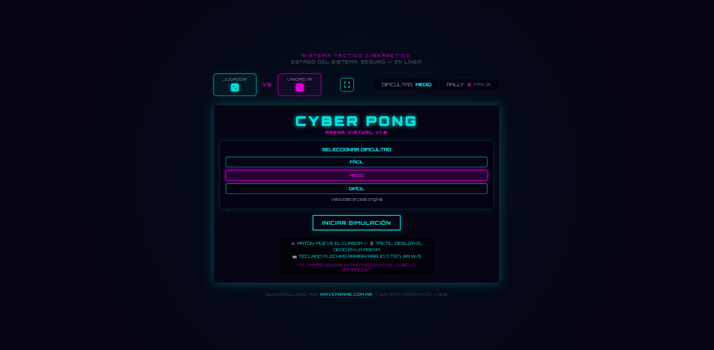
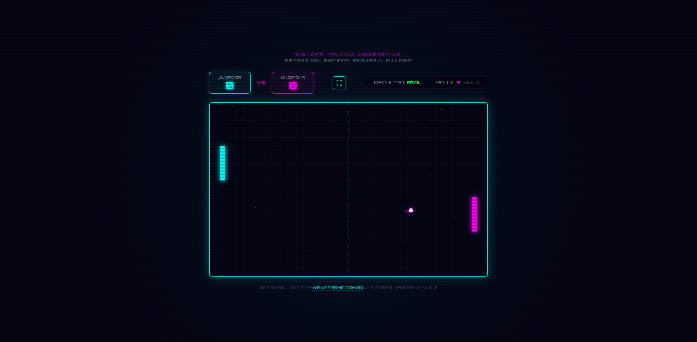

# 🎛️ CYBER PONG

### **Simulación Táctica Retro-Futurista en Tiempo Real**

---

  <b>Cyber Pong</b> es una experiencia arcade retro-futurista de alta fidelidad visual inspirada en la estética <i>Synthwave / Cyberpunk</i>. 
  Desarrollado sobre <b>React + HTML5 Canvas</b>, integra sintesis de audio modular en tiempo real sin archivos multimedia externos y un motor de IA táctico adaptativo.

> ⚡ **DESARROLLADO POR [WAVEFRAME.COM.AR](https://waveframe.com.ar)** // `SISTEMA OPERATIVO v1.0.0`

---

## 🖼️ Galería Visual // Matrix 2x2

  <table>
    <tr>
      <td align="center" width="50%">
        
         
        <b>01 // Menú Táctico & Selección de Dificultad</b>
      </td>
      <td align="center" width="50%">
        
         
        <b>02 // Arena Virtual & Motor de Físicas</b>
      </td>
    </tr>
  </table>

---

## ⚡ Puntos Destacados

* **📺 Estética Neon CRT de Alta Fidelidad:** Renderizado continuo en Canvas HTML5 con efectos analógicos de fósforo, barrido de líneas (scanlines) y resplandor radial retro.
* **🎹 Sintetizador Procedural Web Audio API:** Generación de sonido interactivo en tiempo real mediante osciladores triangulares, sinusoidales y cuadradas. Sin archivos `.mp3` ni latencia de carga.
* **🤖 IA Táctica Adaptativa:** Motor de oponente virtual programado con tres modos (`Fácil`, `Medio`, `Difícil`), predicción de trayectoria vectorial y comportamiento reactivo.
* **📊 HUD Holográfico Integrado:** Panel de control futurista con contador de puntos, registro de racha máxima (*Max Rally*), alternador de modo pantalla completa y selector de dificultad en vivo.
* **📱 Optimización Móvil & Control Táctil:** Interfaz responsiva con gestos táctiles directos y sistema de detección de orientación con aviso para dispositivos móviles (*Landscape lock*).

---

## 🕹️ Experiencia de Control

| Entrada | Acción |
| :--- | :--- |
| ⬆️ / ⬇️  `Flechas` | Mover pala del jugador (Arriba / Abajo) |
| `W` / `S` | Control alternativo de movimiento |
| 👆 `Drag / Touch` | Deslizar dedo en pantalla táctil (Smartphones & Tablets) |
| ⛶ `Pantalla Completa` | Alternar modo inmersivo en el HUD superior |

---

  Diseñado con pasión cibernética por <a href="https://waveframe.com.ar" target="_blank"><b>Waveframe Studio</b></a>

